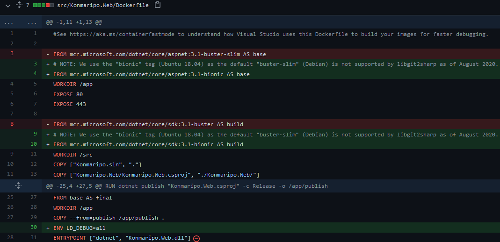

<!-- _footer: "" -->

# Docker For Smaller Feedback Loops

[dockerloops.seankilleen.com](https://dockerloops.seankilleen.com)

<!--
 
Note to self -- you can use 'b' to blank the presentation.
 
None of the images are mine! Credits in HTML.
 
This is a talk about training your brain to know when Docker might help. How to think about moving it into your state of the art

-->

---
<!-- _footer: "" -->

<!-- Image credit: https://unsplash.com/photos/wOHH-NUTvVc -->
---

# What We'll Cover

- What
- Why
- Types
- Examples

---

# Feedback Loops

- Evidence
- Context
- Consequence
- Action

---

#### Feedback Loops

# Sense &amp; Respond

---

<!-- _footer: "" -->

<!-- 
Image credit: https://unsplash.com/photos/FrGYMDjdg4U
  
From https://www.radarsign.com/how-effective-are-radar-speed-signs/
  
A pedestrian hit by a car at 40 mph has a 90% fatality rate; at 20 mph the fatality rate decreases to 10%. As you can see in the graph below, just a small reduction in speed has a dramatic effect on whether those involved live or die.
  
"Studies repeatedly show that when alerted by a radar sign, speeders WILL slow down up to 80% of the time. Typical average speed reductions are 10-20%, and overall compliance with the posted speed limit will increase by 30-60%."
-->

---

---

<video src="./assets/images/loops.mp4" autoplay="true"/>

<!-- 
Image credit: https://twitter.com/johncutlefish/status/1391934227055190019
 
Premise of Agile: Smaller loops with customer
 
Premise of DevOps: Smaller loops between dev and ops
 
Smaller Loops == Each of these examples are less expensive
-->

---

#### The only feedback loop that matters

# The Value Stream

<!-- 
Expensive: Waiting for Servers
 
Expensive: Hanging off to other teams
 
Better: Collaborate on containers and deploy them
-->

---

#### Feedback Loops

# Story Time

<!-- 
Problem: Needed to run multiple Databases locally
 
Expensive: Manually setting up DB Servers
 
Better: Containers
-->

---

#### Story Time

# System Doubles

<!-- 
SQL on Linux: https://hub.docker.com/_/microsoft-mssql-server
 
Emulators
-->

---

docker run --name db-sql -e 'ACCEPT_EULA=Y' -e
'SA_PASSWORD=YOUR_PASSWORD' -p 1433:1433 -v F:\DockerData\db-sql\data:/var/opt/mssql/data -v
F:\DockerData\db-sql\log:/var/opt/mssql/log -v F:\DockerData\db-sql\secrets:/var/opt/mssql/secrets -d
mcr.microsoft.com/mssql/server:2019-latest

---

<mark>docker run --name db-sql</mark> -e 'ACCEPT_EULA=Y' -e
'SA_PASSWORD=YOUR_PASSWORD' -p 1433:1433 -v F:\DockerData\db-sql\data:/var/opt/mssql/data -v
F:\DockerData\db-sql\log:/var/opt/mssql/log -v F:\DockerData\db-sql\secrets:/var/opt/mssql/secrets -d
mcr.microsoft.com/mssql/server:2019-latest

---

docker run --name db-sql <mark>-e 'ACCEPT_EULA=Y' -e
'SA_PASSWORD=YOUR_PASSWORD'</mark> -p 1433:1433 -v F:\DockerData\db-sql\data:/var/opt/mssql/data -v
F:\DockerData\db-sql\log:/var/opt/mssql/log -v F:\DockerData\db-sql\secrets:/var/opt/mssql/secrets -d
mcr.microsoft.com/mssql/server:2019-latest

---

docker run --name db-sql -e 'ACCEPT_EULA=Y' -e
'SA_PASSWORD=YOUR_PASSWORD' <mark>-p 1433:1433</mark> -v F:\DockerData\db-sql\data:/var/opt/mssql/data -v
F:\DockerData\db-sql\log:/var/opt/mssql/log -v F:\DockerData\db-sql\secrets:/var/opt/mssql/secrets -d
mcr.microsoft.com/mssql/server:2019-latest

---

docker run --name db-sql -e 'ACCEPT_EULA=Y' -e
'SA_PASSWORD=YOUR_PASSWORD' -p 1433:1433 <mark>-v F:\DockerData\db-sql\data:/var/opt/mssql/data -v
F:\DockerData\db-sql\log:/var/opt/mssql/log -v F:\DockerData\db-sql\secrets:/var/opt/mssql/secrets</mark> -d
mcr.microsoft.com/mssql/server:2019-latest

---

docker run --name db-sql -e 'ACCEPT_EULA=Y' -e
'SA_PASSWORD=YOUR_PASSWORD' -p 1433:1433 -v F:\DockerData\db-sql\data:/var/opt/mssql/data -v
F:\DockerData\db-sql\log:/var/opt/mssql/log -v F:\DockerData\db-sql\secrets:/var/opt/mssql/secrets <mark>-d
mcr.microsoft.com/mssql/server:2019-latest</mark>

---

#### Story Time

# Development Environment

---

#### Story Time

# System Flexibility

<!-- 
Linux on Konmaripo: https://github.com/excellalabs/konmaripo/commit/9c516c56ce7d0ba8056b0dc01ae9fdc240cd5abe#diff-fefee25bf9a9dbf03d1ac8db011a6f5a4a0c33bf9d8dec4f937ac8f85b1eea65
-->

---
<!-- _footer: "" -->

---

#### Story Time

# CI Support

<!-- GitHub Actions for NUnit Docs: https://github.com/nunit/docs/actions/workflows/build-process.yml -->

---

#### Story Time

# Experimenting

<!-- 
Matomo
 
Neo4j
-->

---

---

<!-- _footer: "" -->

# Thanks

- :bird: [sjkilleen](https://twitter.com/sjkilleen)
- :earth_americas: [SeanKilleen.com](https://seankilleen.com)
- :briefcase: [Excella](https://excella.com)
